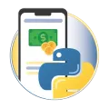

# Santander Bootcamp 2025 | Back-End with Python

<h2> Basic Bank System </h2>

A basic banking system built in Python as the first hands-on project of the bootcamp. It simulates account operations like deposits, withdrawals (limited per day), and statement generation using dictionaries. Despite its simplicity, it already uses functions and a modular structure, setting the foundation for more advanced financial systems built later in the program.

<h2> Code Challanges 00 </h2>
<table><tr><th>Exploring Operators and String Manipulation</th></tr><tr><td>

| Online Discount | E-mail checker |
| :-: | :-: |
|  |  |

</tr></td></tr></table>

<h2> Code Challanges 01 </h2>
<table><tr><th>Applying Datas and List</th></tr><tr><td>

| Shopping Cart | Event Organizer |
| :-: | :-: |
|  |  |

</tr></td></tr></table>

<h2> Medium Bank System v1 </h2>

This version improves the initial banking system with a centralized data structure and stricter validations. It introduces automatic login generation, full user registration, CPF duplication checks, and consistent monetary formatting. Code was modularized into smaller, maintainable functions, making the system more robust and scalable while preserving core features like deposits, withdrawals, and transaction tracking.

<h2> Code Challanges 02 </h2>
<table><tr><th>Working with functions</th></tr><tr><td>

| Medical Triage System | Hotel Reservation System |
| :-: | :-: |
|  |  |

</tr></td></tr></table>

<h2> Advanced Bank System v2. </h2>

The system transitions from procedural to object-oriented programming, improving scalability and clarity. With a fully restructured codebase and architecture, this version introduces classes to manage users, accounts, and operations. It also enhances registration by requiring a date of birth and consolidates user data management into a more maintainable, modular, and professional backend structure.

<h2> Code Challanges 03 </h2>
<table><tr><th>Working with functions</th></tr><tr><td>

| Vehicle Manager System | Restaurant Order System |
| :-: | :-: |
|  |  |

</tr></td></tr></table>

<h2> Code Challanges 04 </h2>
<table><tr><th>Working with Python Packeges</th></tr><tr><td>

| Access Control System | Stock Control System |
| :-: | :-: |
|  |  |

</tr></td></tr></table>

<h2> Advanced API Development </h2>

This is the final project from the bootcamp. The proposal was to create an API using FastAPI. I chose to redesign the previous project, but in API format, using FastAPI (as proposed) and SQLAlchemy for the database.

